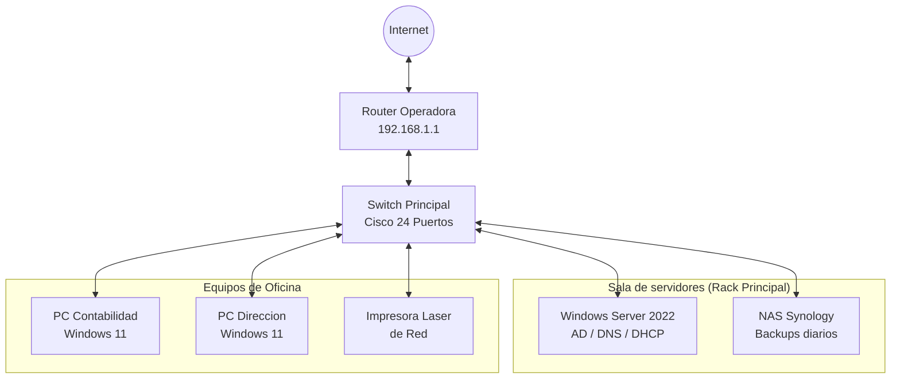

# Infraestructura de la Red Local "TechPYME"

Documentacion tecnica de la nueva infraestructura de red. Este proyecto es **altamente critico** para el funcionamiento de la empresa y cualquier cambio en los servidores debe hacerse con *extrema precaucion*

> [!WARNING]
> **Ventana de mantenimiento**: CUalquier reinicio del swithc principal o del router de la operadores de realizarse estrictamente fuera del horario laboral (despues de las 18:00h) para evitar la desconexcion de los equipo de Contabilidad y Direccion

Para mas destalles sobre los estandares de cableado estructurado aplicados, puedes consultar la normativa de la [Asociacion de la industria de Telecomuncaciones (TIA)](https://tiaonline.org/)

## Topologia de la Red
A continuacion se presenta un diagrama de arquitectura de la red locla, mostrando la conexion desde el exterior hasta los equipos finales:



## Configuracion del Servidor (PowerShell)
Para que el servidor Windows Server actua correctamente dentor del dominio, necesita una direccion IP estatica. Hemos automatizado este proceso con el siguiente bloque de codigo

```powershell
# Script para configurar una IP estatica en la interfaz principal
# Script para configurar una IP estática en la interfaz principal
$IP = "192.168.1.10"
$Mascara = 24
$PuertaEnlace = "192.168.1.1"

Write-Host "Configurando el adaptador de red..."
New-NetIPAddress -InterfaceAlias "Ethernet" -IPAddress $IP `
  -PrefixLength $Mascara -DefaultGateway $PuertaEnlace

# Configurar el propio servidor como DNS primario (Localhost)
Set-DnsClientServerAddress -InterfaceAlias "Ethernet" `
  -ServerAddresses "127.0.0.1"
```

## Tabla de Direccionamiento IP (IPv4)
A continuacion se detalla la asignacion de direcciones para los dispositivos estaticos de la red (el resto de equipos reciben IP por DHCP)

| Equipo / Dispositivo | Direccion Ip | Mascara de Subred   | Funcion Principal              |
| :---                 | :---:        | :---:               | :---
| Router Operadora     | 192.168.1.1  | /24 (255.255.255.0) | Puerta de Enlace (Gateway)     |               
| Windows Server       | 192.168.1.10 | /24 (255.255.255.0) | Controlador de Dominio y DNS   |
| NAS                  | 192.188.1.15 | /24 (255.255.255.0) | Almacenamiento en red y Copias |
| Impresora Oficina    | 192.168.1.20 | /24 (255.255.255.0) | Impresion compartida           |

